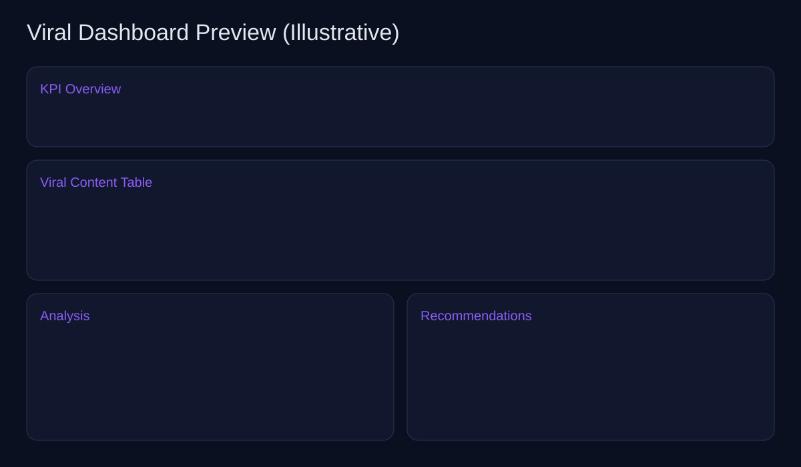

# Viral Dashboard

A premium-style full-stack dashboard for Instagram content research using **sample/mock data** (no scraping).

## What this app does

- Analyzes mock viral content in your niche
- Surfaces KPIs (posts analyzed, avg engagement, top format, best time, top hooks)
- Saves research inputs (hashtags, competitors, niche)
- Provides filters + viral content table
- Generates trend-based content recommendations
- Includes placeholders for future **Instagram Graph API / approved data source** integrations

---

## Tech Stack

- **Frontend:** React + Vite + Recharts
- **Backend:** FastAPI + SQLAlchemy
- **Database:** SQLite

---

## Project Structure

```
backend/
  app/
    main.py
    db.py
    models.py
    schemas.py
    crud.py
    seed.py
  requirements.txt
frontend/
  src/
    App.jsx
    api.js
    main.jsx
    styles.css
  package.json
Makefile
```

---

## Quick Start (One-click seed included)

### 1) Backend setup

```bash
cd backend
python -m venv .venv
source .venv/bin/activate
pip install -r requirements.txt
```

### 2) Seed sample data (one-click)

From repo root:

```bash
make seed
```

Or directly:

```bash
cd backend
source .venv/bin/activate
python -m app.seed
```

### 3) Run backend

From repo root:

```bash
make backend
```

Or directly:

```bash
cd backend
source .venv/bin/activate
uvicorn app.main:app --reload --port 8000
```

### 4) Run frontend

```bash
cd frontend
npm install
npm run dev
```

Frontend URL: `http://localhost:5173`  
Backend URL: `http://localhost:8000`

---

## Verify app is working

```bash
curl http://localhost:8000/health
curl http://localhost:8000/api/dashboard/summary
curl "http://localhost:8000/api/content?min_views=10000&format=Reel"
```

---

## API Endpoints

- `GET /health`
- `GET /api/dashboard/summary`
- `GET /api/content` (filters: hashtag, creator, format, min_views, start_date, end_date)
- `GET /api/analysis`
- `GET /api/recommendations`
- `GET /api/searches`
- `POST /api/searches`

---

## Future Instagram Graph API / Approved Data Integration

The app is intentionally mock-data-first. To add approved data sources later:

1. Add an ingestion service in backend (e.g., `app/integrations/instagram_graph.py`)
2. Replace seed-driven datasets with scheduled sync jobs
3. Map approved fields into `ContentPost`
4. Keep recommendation engine backed by approved metrics

Search for `TODO(INSTAGRAM_API)` in backend files for insertion points.

---

## Sample Preview



---

## Dashboard Preview

A live screenshot could not be embedded from this environment due package registry restrictions during frontend install.

Preview sections included in UI:
- Hero/KPI overview
- Research input panel
- Filter controls
- Viral content table
- Analysis cards + chart
- Recommendation cards

---

## Notes

- No illegal scraping is implemented.
- This is an agency-style starter that can be hardened with auth, background jobs, and production DB later.
